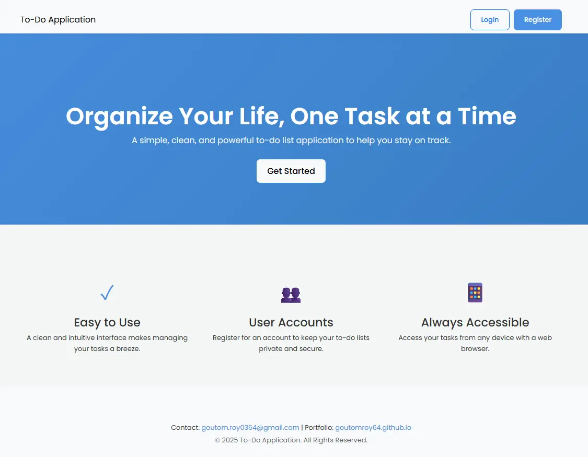
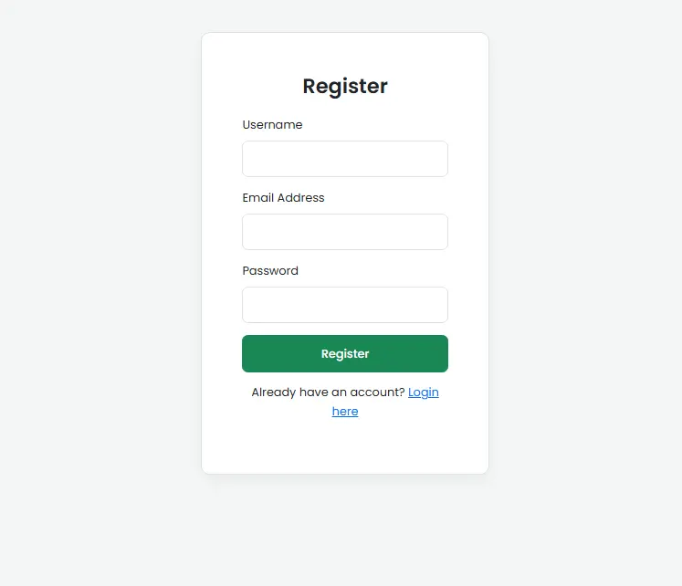
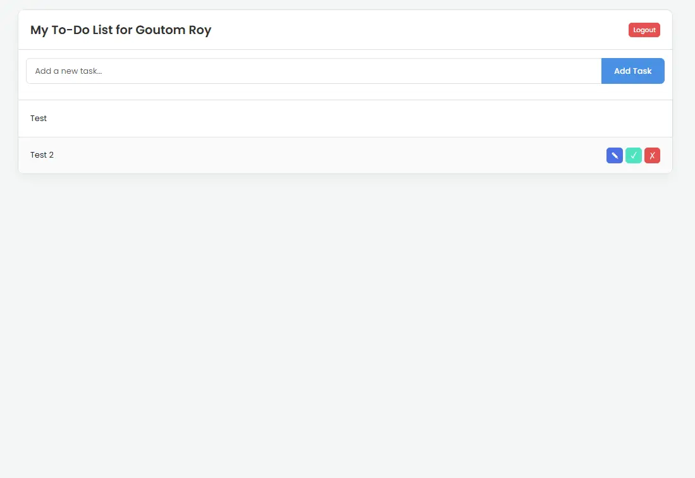

# Full-Stack To-Do List Application

A complete and feature-rich to-do list application built with PHP, MySQL, and modern frontend technologies. This project allows users to register, log in, and manage their personal tasks in a clean and intuitive interface.

## Live Demo

[To-do.page.gd]

## Features

- **User Authentication:** Secure registration and login system for individual user accounts.
- **Task Management (CRUD):**
    - **Create:** Add new tasks.
    - **Read:** View all your tasks in a clean list.
    - **Update:** Mark tasks as complete and rename them inline.
    - **Delete:** Remove tasks you no longer need.
- **Responsive Design:** A professional and modern UI that works on both desktop and mobile devices.
- **Secure Backend:** Uses PHP for server-side logic and prepared statements to prevent SQL injection.
- **RESTful API:** A consolidated API endpoint (`api.php`) handles all task-related actions.

## Tech Stack

- **Backend:** PHP
- **Database:** MySQL
- **Frontend:** HTML5, CSS3, JavaScript (ES6+)
- **Styling:** Bootstrap 5 & Custom CSS

## Screenshots

| Landing Page | Login/Register | Main Application |
| :---: | :---: | :---: |
|  |  |  |

## File Structure

The project is organized into a clean and manageable structure:

```
/todo-application/
|
|-- index.html            (Landing Page)
|-- app.php               (Main To-Do List Application)
|-- login.html            (Login and Registration Page)
|-- config.php            (Database Configuration)
|-- style.css             (Stylesheet)
|-- auth.js               (JavaScript for Login/Register)
|
|-- api.php               (Handles all task-related actions)
|-- auth.php              (Handles all authentication actions)
```

## Local Setup and Installation

To run this project on your local machine, follow these steps:

**1. Prerequisites:**
   - A local server environment like [XAMPP](https://www.apachefriends.org/index.html) or WAMP.

**2. Clone the Repository:**
   ```bash
   git clone [https://github.com/GoutomRoy64/To-Do-Application.git](https://github.com/GoutomRoy64/To-Do-Application.git)
   ```

**3. Move to `htdocs`:**
   - Move the entire project folder into the `htdocs` directory of your XAMPP installation.

**4. Database Setup:**
   - Open phpMyAdmin (`http://localhost/phpmyadmin`).
   - Create a new database named `todo_db`.
   - Select the `todo_db` database and go to the **SQL** tab.
   - Run the following SQL queries to create the necessary tables:

   ```sql
   -- Create the 'users' table
   -- Email is the unique identifier, username can be duplicated.
   CREATE TABLE `users` (
     `id` int(11) UNSIGNED NOT NULL AUTO_INCREMENT,
     `username` varchar(50) NOT NULL,
     `email` varchar(100) NOT NULL,
     `password` varchar(255) NOT NULL,
     `created_at` timestamp NOT NULL DEFAULT current_timestamp(),
     PRIMARY KEY (`id`),
     UNIQUE KEY `email` (`email`)
   ) ENGINE=InnoDB DEFAULT CHARSET=utf8mb4;

   -- Create the 'tasks' table
   CREATE TABLE `tasks` (
     `id` int(6) UNSIGNED NOT NULL AUTO_INCREMENT,
     `user_id` int(11) UNSIGNED NOT NULL,
     `task_description` varchar(255) NOT NULL,
     `is_completed` tinyint(1) NOT NULL DEFAULT 0,
     `created_at` timestamp NOT NULL DEFAULT current_timestamp(),
     PRIMARY KEY (`id`),
     KEY `user_id` (`user_id`),
     CONSTRAINT `tasks_ibfk_1` FOREIGN KEY (`user_id`) REFERENCES `users` (`id`) ON DELETE CASCADE
   ) ENGINE=InnoDB DEFAULT CHARSET=utf8mb4;
   ```

**5. Configure the Database Connection:**
   - Open the `config.php` file.
   - Ensure the database credentials match your local setup (they should be correct by default for XAMPP).

**6. Run the Application:**
   - Open your web browser and navigate to `http://localhost/your-project-folder-name/`.

## Contact

Goutom Roy
- **Email:** [goutom.roy0364@gmail.com](mailto:goutom.roy0364@gmail.com)
- **Portfolio:** [https://goutomroy64.github.io/Portfolio_V1](https://goutomroy64.github.io/Portfolio_V1)

